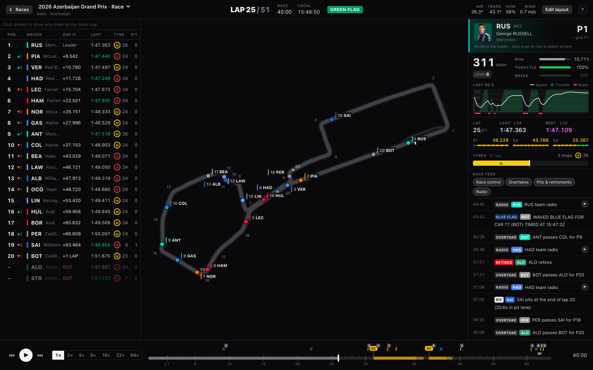
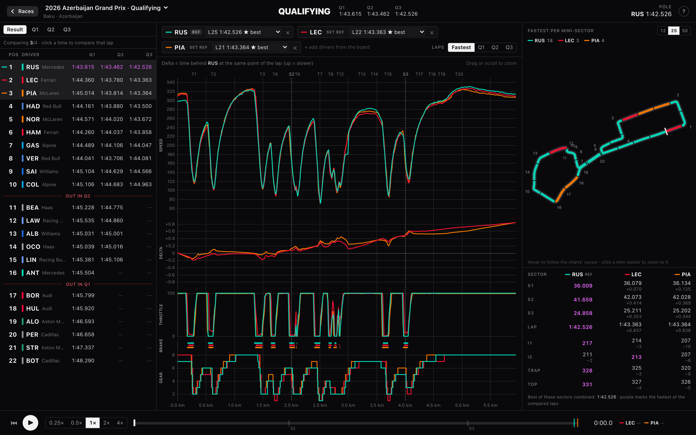
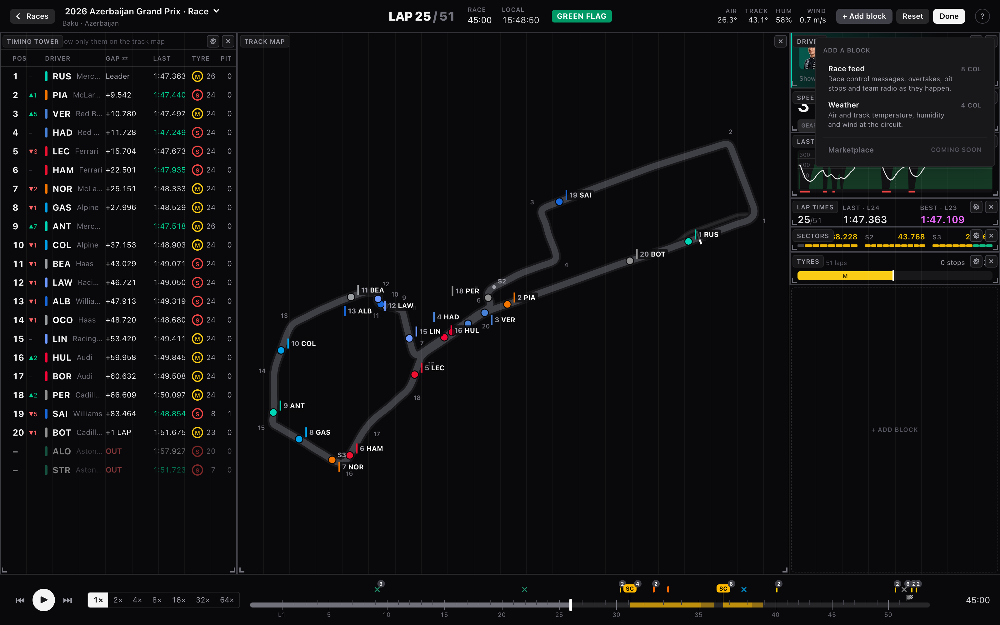

<h1>
  <picture>
    <source media="(prefers-color-scheme: dark)" srcset="public/pitwall-logo.svg" />
    
  </picture>
</h1>

Replay or follow a live F1 race on a polished timing screen made of blocks you arrange. Each block is a different kind of analysis. Built on [OpenF1](https://openf1.org) data. Runs in your browser.

**Try it: [pitwall.plusminushalf.com](https://pitwall.plusminushalf.com)**. The hosted site plays replays only. Live works only when you [run Pitwall locally](#run-it-locally), for now.



## What it does

- **Replays.** Every race, sprint, qualifying and free practice session since 2023. A race starts about 5 seconds after you pick it. It downloads into your browser as you watch, so next time it opens at once.
- **One timeline** for timing, gaps, tyres, pit stops, race control, weather and team radio. Pause, scrub, or play at up to 64×.
- **Blocks.** Move, resize, add or remove them. Your layout is saved.
- **Race analysis.** Gaps to the leader or the car ahead, lap by lap. Lap times per stint, with each stint's trend in seconds per lap. Battles: cars within a second for laps on end, and who passed whom. Pit stops, and whether each undercut worked. Click a lap, a battle or a stop to watch it.
- **No spoilers.** The timeline shows only what you've watched. Safety cars, retirements, penalties and the finish stay hidden until you get there.
- **Qualifying** has its own screen. Compare up to 4 laps: speed, delta, throttle, brake and gear. See who is fastest in each mini-sector. Replay the laps as ghosts.
- **Free practice** has the timing screen by best lap, with the clock counting down. Deleted lap times are struck through. Long runs ranks every race simulation (5+ laps on a set) by compound, with its average and how much slower it gets per lap. Fastest laps compares up to 4 laps as qualifying does, each with its tyre and its age.
- **Live.** Follow a race, sprint or practice session as it happens. It needs an OpenF1 account. It works only when you run Pitwall locally, not on the hosted site.
- **Desktop only**, for now.

| Qualifying | Edit the layout |
| --- | --- |
|  |  |

## Your own OpenF1 account (optional)

Replays need no account. On OpenF1's free tier, a race is fully downloaded in about a minute, and qualifying opens in about 20 seconds. An account makes downloads faster. They also keep working during live sessions, when OpenF1 blocks the free tier. It doesn't add live mode to the hosted site yet.

1. Sponsor OpenF1 at [openf1.org](https://openf1.org) (€9.90/month). You get an OpenF1 login: an email and a password.
2. In Pitwall, open **Settings** (top right of the home page). Click **Connect** under "OpenF1 account".
3. Sign in in the popup. Stay connected on this device, or lock it behind a passkey.

Pitwall's code never sees your password. A small vault on a separate site (`pitwall-auth.garvit.in`) holds it and talks to OpenF1. Pitwall only gets the data. Details: [vault/README.md](vault/README.md).

The sponsor tier is a personal subscription. Use your own account. Don't share it.

## Run it locally

```sh
bun install
bun run dev      # http://localhost:5173
bun run build    # static site in dist/
```

For live, put your OpenF1 login in `.env` and run a small relay next to the dev server. It's for your own use. Don't host it for others.

```sh
cp .env.example .env   # then fill in OPENF1_USERNAME and OPENF1_PASSWORD
bun run live
```

CLI ingest, the live simulator and how it all works: [docs/development.md](docs/development.md).

## Write a block

A block is a folder in [`src/blocks/`](src/blocks). Its `index.tsx` default-exports `defineBlock({ ... })`. It reads the race through block-kit's hooks. The hooks return data only up to the replay's current time, so a block can't spoil a race by accident. The one opt-out is `useWholeSession()`.

A whole block:

```tsx
// src/blocks/fastest-lap/index.tsx
import { defineBlock, lapTime, Stat, useFastestLap } from "block-kit";

function FastestLap() {
  const lap = useFastestLap(); // the fastest lap so far, never one still to come
  return (
    <Stat label="Fastest lap" className="h-full justify-center px-3">
      <span className="text-sm tabular-nums">{lap ? `${lapTime(lap.duration)} by #${lap.driver}` : "None yet"}</span>
    </Stat>
  );
}

export default defineBlock({
  id: "fastest-lap", // kebab-case, the same as the folder
  name: "Fastest lap",
  description: "The fastest lap so far, and who set it.", // shown in the block picker
  version: "1.0.0",
  height: 48, // px
  width: { min: 8, default: 10, max: 25 }, // percent of the grid's width
  sessions: ["race"], // races and sprints
  settings: {},
  Component: FastestLap,
});
```

1. Make a folder in `src/blocks/` with an `index.tsx` like the one above.
2. Pick your hooks. They're all listed in [`src/blockkit/index.ts`](src/blockkit/index.ts). Import them from `"block-kit"`.
3. Register the block in [`src/grid/builtins.ts`](src/grid/builtins.ts): import it and add it to the `ALL` list. It then shows up under **Edit layout** → **+ Add block**.
4. Run `bun run lint` and `bun test src/blocks`. The lint checks that a block imports only React, `block-kit` and files in its own folder.
5. Open a PR.

[`weather`](src/blocks/weather/index.tsx) is the smallest real block. `gap-chart`, `stint-pace`, `battles` and `pit-strategy` are bigger. Each keeps its logic in a separate file, with tests next to it.

To match the app's look, use block-kit's UI pieces: `Label`, `Stat`, `Icon`, `DriverTag` and `TyreBadge`. See [DESIGN.md](DESIGN.md).

### What a block can read

- **Timing:** `useRunningOrder`, `usePositions`, `useDriver` (position, gaps, tyres, lap, status), `useFastestLap`, `useBestSectors`.
- **Laps and strategy:** `useLaps` (sector times, mini-sectors, speed traps), `useStints`, `usePitStops` (pit lane and stationary time). `useAllLaps`, `useAllStints` and `useAllPitStops` cover the whole field.
- **Telemetry:** `useCar` (speed, gear, RPM, throttle, brake, DRS), `useCarHistory` (recent samples), `useFrame` (car positions every animation frame, for canvas drawing).
- **The race:** `useTrackStatus`, `useNeutralPeriods` (SC, VSC and red flag periods), `useSectorFlags`, `useWeather`, `useFeed` (race control, overtakes, pit stops, team radio).
- **Session:** `useDrivers` (names, teams, colours), `useTrack` (outline, pit lane, corners, sectors), `useSessionInfo`.
- **Playback and the block:** `useTime`, `usePlayback`, `useSelection`, `useSettings`, `useBlockSize`.

## Request a block

Not up for writing one? Missing some data? [Open an issue](https://github.com/plusminushalf/pitwall/issues/new?labels=enhancement). Say what you want to see and why.

## Not a distribution of OpenF1 data

Pitwall ships code, not data. Your browser downloads each race straight from OpenF1. It's processed and stored in your browser only. No server of ours hosts, bundles or relays F1 data. This repo contains none.

OpenF1 data is licensed [CC BY-NC-SA 4.0](https://creativecommons.org/licenses/by-nc-sa/4.0/). Non-commercial use only.

Pitwall is an unofficial fan project. It is not associated with the Formula 1 companies or with OpenF1. F1, FORMULA ONE, FORMULA 1, FIA FORMULA ONE WORLD CHAMPIONSHIP, GRAND PRIX and related marks are trade marks of Formula One Licensing B.V.

## Analytics

The hosted site counts visits with [Cloudflare Web Analytics](https://www.cloudflare.com/web-analytics/): which pages are viewed (Home or a session), plus country, browser and referrer. No cookies. Builds you run yourself have none.

## License

Code: [GNU AGPL v3.0](LICENSE) (`AGPL-3.0-only`), © 2026 plusminushalf. Use it, change it, share it. If you distribute a modified version, or run one that others use over a network, publish its source under the same license.

The license covers the code only. Race data falls under OpenF1's license above.
